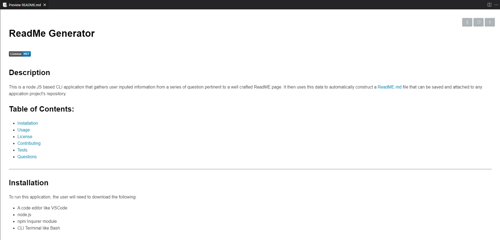
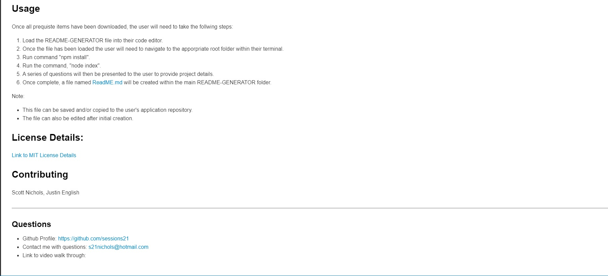
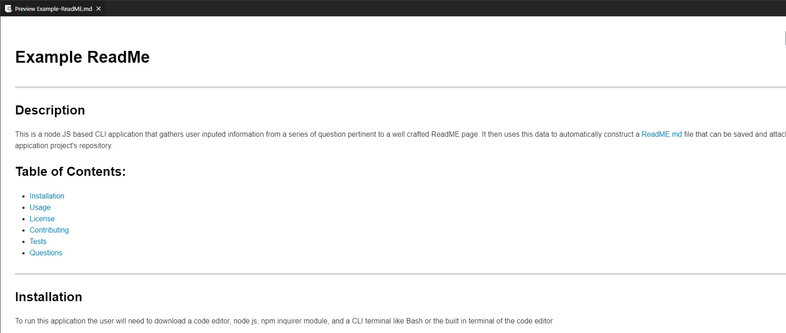
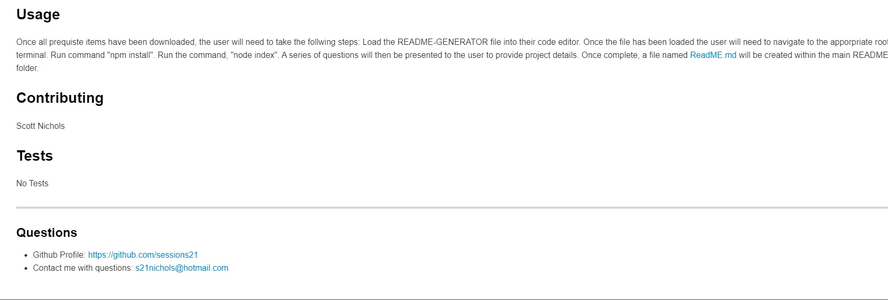

# **ReadMe Generator**
 
 -------------------------------
## Description 
  This is a node.JS based CLI application that gathers user inputed information from a series of question pertinent to a well crafted ReadME page.  It then uses this data to automatically construct a ReadME.md file that can be saved and attached to any appication project's repository. 

## Table of Contents:
  * [Installation](#installation)
  * [Usage](#usage)
  * [License](#license)
  * [Contributing](#contributing)
  * [Tests](#tests)
  * [Questions](#questions)
 --------------------------------- 
## Installation
  To run this application, the user will need to download the following:
  - A code editor like VSCode
  - node.js
  - npm Inquirer module
  - CLI Terminal like Bash

## Usage
  Once all prequiste items have been downloaded, the user will need to take the follwing steps:
  1. Load the README-GENERATOR file into their code editor.  
  2. Once the file has been loaded the user will need to navigate to the apporpriate root folder within their terminal.
  3. Run command "npm install".
  4. Run the command, "node index". 
  5. A series of questions will then be presented to the user to provide project details.  
  6. Once complete, a file named ReadME.md will be created within the main README-GENERATOR folder.  
  
  Note:
  * This file can be saved and/or copied to the user's application repository.  
  * The file can also be edited after initial creation. 

## License Details:
 [Link to MIT License Details](https://choosealicense.com/licenses/mit/)

## Tests
  No tests included for this application.

## Contributing
  * Scott Nichols

 ---------------------------------
### Questions
* Github Profile: https://github.com/sessions21
* Contact me with questions: s21nichols@hotmail.com
* Link to video walk through: https://www.awesomescreenshot.com/video/6682095?key=25c21447b5c06c71e25ccb7d34887590

### Example Output:
 * **With a License & Badge Section**

 ----------------------------------

 * **Without a License or Badge Section**

